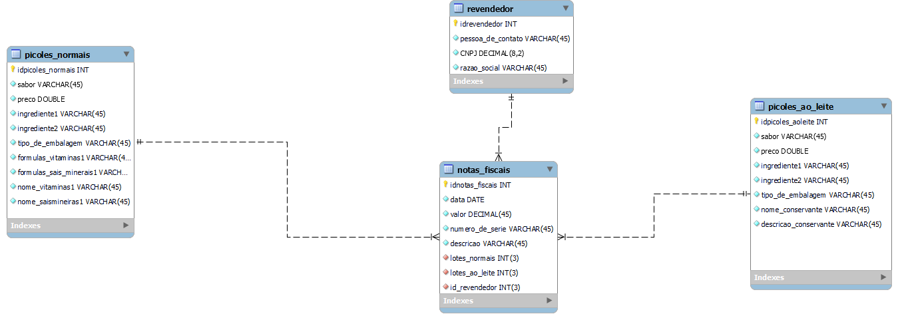
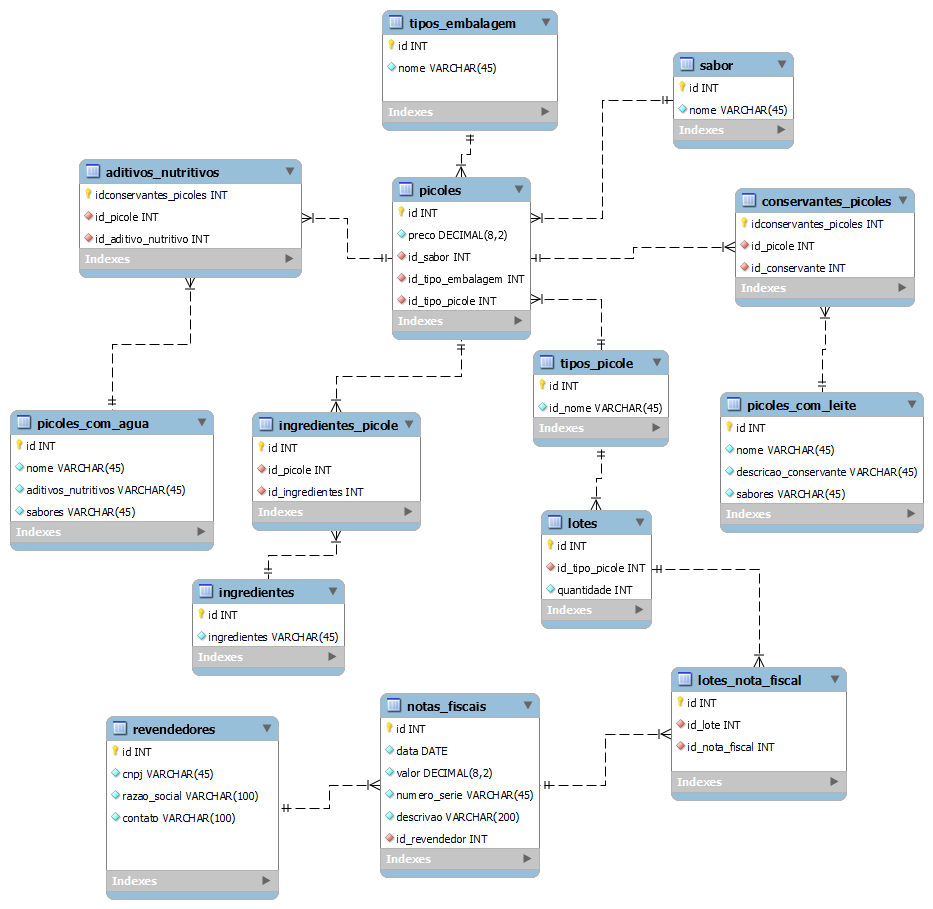

# Data and SQL

## Exercício Modelagem de Dados

Uma empresa fabricante de picolés deseja armazenar informações acerca deseusnegócios.Ospicolés fabricados são divididos em normal (com água) e ao leite. As informações comuns armazenadas dos picolés são: sabor, ingredientes, preço e tipo da embalagem. Especificamente, picolés normais possuem um conjunto de aditivos nutritivos (vitaminas ou sais minerais)cadaum com nome e fórmula química; e picolés ao leite contêm um conjunto de conservantes,cada um com nome e descrição. Os dois tipos de picolés são vendidos emlotes exclusivos(ou normais,ou ao leite) para os revendedores e cada venda gera uma nota fiscal que podeconter umo uvários lotes. As notas fiscais possuem data, valor, número de série e descrição. Todo revendedor possui uma pessoa de contato para eventuais resoluções de problemas, alémdisso, armazena-sedo revendedor o CNPJ e a razão social. Deseja-se obter relatórios sobre as vendas mensais dos picolés de cada tipo e quais revendedores compraram mais picolés nos últimos meses.

Passos da Resolução:

- Encontrar as entidades
- Definir os atributos
- Definir os relacionamentos

-------------------------------------------------

[1] Os picolés fabricados são divididos em normal (com água) e ao leite. As informações comuns armazenadas dos picolés são: sabor, ingredientes, preço e tipo da embalagem. 

Entidades:

- Picoles (id, preco, id sabor, id tipo de embalagem, id tipo de picole)
- Picoles Com Leite (id, nome, sabores, aditivo nutritivo);
- Picoles Com Água (id, nome, sabores, conservantes);
- Tipo da embalagem (id, nome);
- Sabor (id, nome do sabor);
- Ingredientes (id, nome);
- Ingredientes Picole (id, id ingrediente, id picole); -> responsável por correlação entre as tabelas

-------------------------------------------------

[2] Especificamente, picolés normais possuem um conjunto de aditivos nutritivos (vitaminas ou sais minerais) cada
um com nome e fórmula química; e picolés ao leite contêm um conjunto de conservantes, cada
um com nome e descrição. 

- Aditivos Nutritivos (id, nome, fórmula quíimica))
- Aditivos Nutritivos Picole (id, id aditivo nutritivo, id picole);  -> responsável por correlação entre as tabbelas
- Conservantes (id, nome, descricao);
- Conservantes Picole (id, id conservante, id picole);  -> responsável por correlação entre as tabbelas

-------------------------------------------------

[3] Os dois tipos de picolés são vendidos em lotes exclusivos (ou normais, ou ao leite) para os revendedores e cada venda gera uma nota fiscal que pode conter um ou vários lotes. As notas fiscais possuem data, valor, número de série e descrição. 

Entidades:
- Lotes (id, id tipo picole, quantidade);
- Nota Fiscal (id, data, valor, número de série, descricao, id revendedor);
- Lotes Nota Fiscal (id, id lote, id nota fiscal);

-------------------------------------------------
[4] Todo revendedor possui uma pessoa de contato para eventuais resoluções de problemas, além disso, armazena-se
do revendedor o CNPJ e a razão social. 

Entidades:
- Revendedor (id, cnpj, razão social, contato);

Esse foi o esboço da primeira representação, sem se preocupar com probblemas de escala:

Esse foi o esboço final da modelagem, se preocupando com formas de escalar o sistema:

